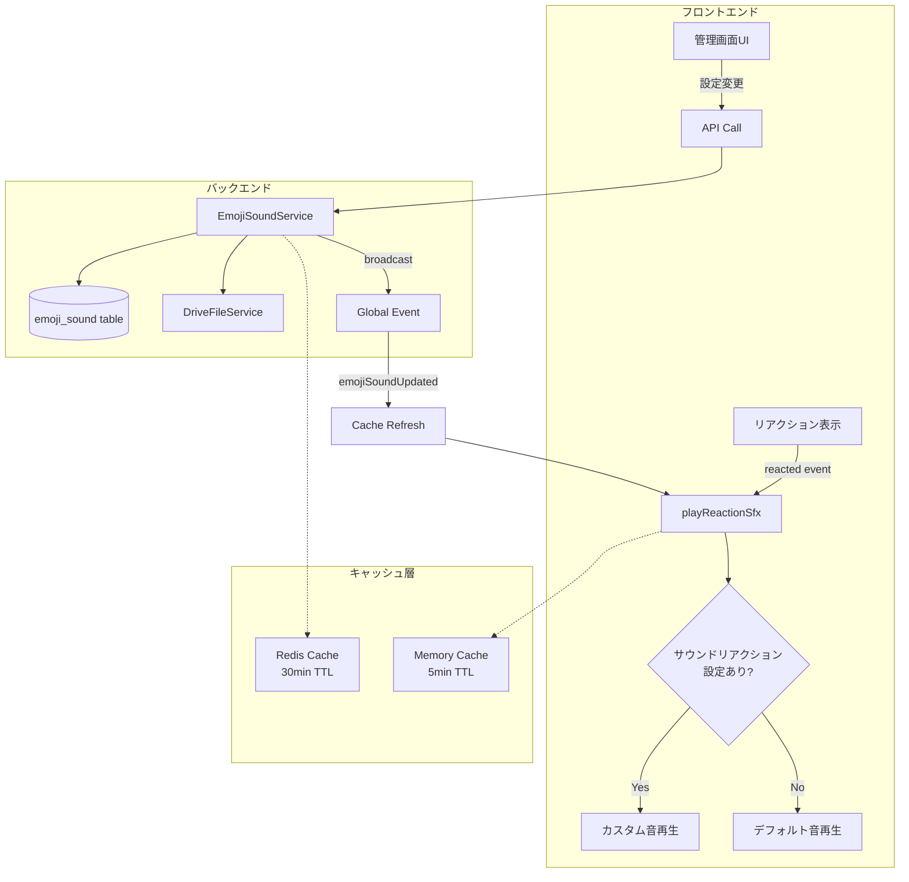
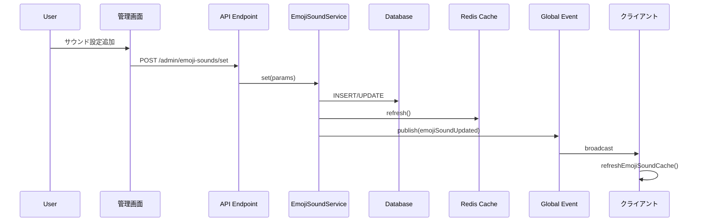
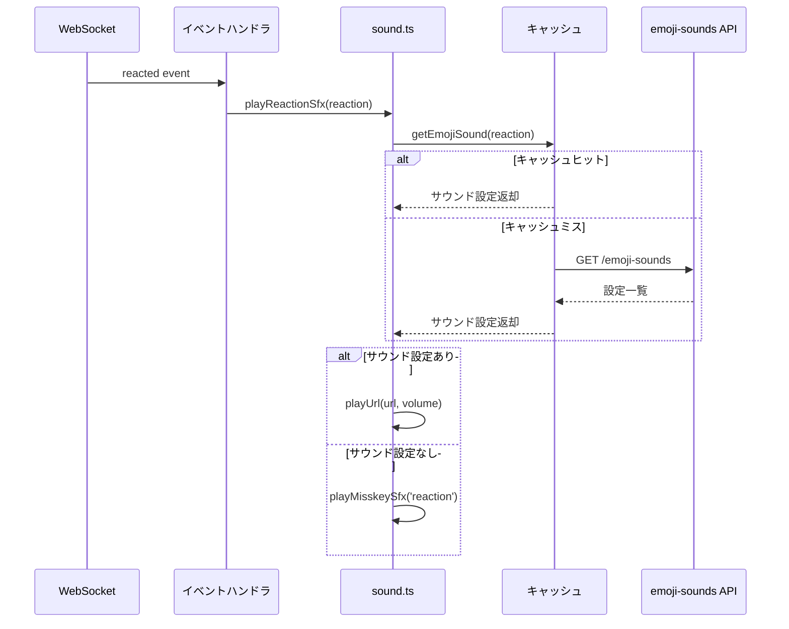

# サウンドリアクション機能 詳細設計書

## 1. 概要

絵文字リアクションに対してサウンドを紐づけ、リアクションが押された時に音を再生する機能を実装します。

### 要件
- 管理者は絵文字（カスタム絵文字・Unicode絵文字）にサウンドを紐づけられる
- サウンドはドライブ上のファイルを指定可能
- サウンドを紐づけた絵文字をリアクションとして押すと、その音が鳴る
- 自分を含め全員がリアクションした時に鳴る（画面上にリアクションが追加された時）
- 既存の4ttenakuinu特別処理を削除し、サウンドリアクションで置き換える

---

## 2. データベース設計

### 2.1 新規テーブル: `emoji_sound`

絵文字とサウンドの紐づけを管理するテーブル

#### カラム定義

| カラム名 | 型 | NULL | デフォルト | 説明 |
|---------|-----|------|-----------|------|
| id | varchar(32) | NOT NULL | - | プライマリキー |
| createdAt | timestamp with time zone | NOT NULL | CURRENT_TIMESTAMP | 作成日時 |
| updatedAt | timestamp with time zone | NULL | - | 更新日時 |
| reaction | varchar(256) | NOT NULL | - | リアクション文字列 (`:emoji:` または `❤` など) |
| fileId | varchar(32) | NOT NULL | - | ドライブファイルID |
| volume | float | NOT NULL | 1.0 | 音量 (0.0～1.0) |

#### インデックス

- PRIMARY KEY: `id`
- UNIQUE INDEX: `reaction` (同じリアクションに複数のサウンドは設定不可)

#### 外部キー制約

- `fileId` → `drive_file(id)` ON DELETE CASCADE

### 2.2 リレーション

- `MiEmojiSound` ← many-to-one → `MiDriveFile`

---

## 3. バックエンドAPI設計

### 3.1 エンドポイント一覧

#### 3.1.1 `admin/emoji-sounds/list` (GET)

**概要**: サウンド設定一覧を取得

**権限**: `canManageCustomEmojis`

**パラメータ**: なし

**レスポンス**:
```typescript
{
  emojiSounds: Array<{
    id: string;
    reaction: string;
    file: DriveFile;
    volume: number;
    createdAt: string;
    updatedAt: string | null;
  }>
}
```

#### 3.1.2 `admin/emoji-sounds/set` (POST)

**概要**: サウンド設定を追加・更新（既存のreactionがあれば更新、なければ新規作成）

**権限**: `canManageCustomEmojis`

**パラメータ**:
```typescript
{
  reaction: string;    // リアクション文字列（例: `:kawaii:`, `❤`）
  fileId: string;      // ドライブファイルID
  volume?: number;     // 0.0～1.0 (デフォルト: 1.0)
}
```

**バリデーション**:
- `reaction`: 1-256文字
- `fileId`: 有効なドライブファイルIDであること
- `volume`: 0.0～1.0の範囲

**レスポンス**:
```typescript
{
  id: string;
  reaction: string;
  file: DriveFile;
  volume: number;
}
```

#### 3.1.3 `admin/emoji-sounds/delete` (POST)

**概要**: サウンド設定を削除

**権限**: `canManageCustomEmojis`

**パラメータ**:
```typescript
{
  id: string;  // EmojiSoundのID
}
```

**レスポンス**: `204 No Content`

#### 3.1.4 `emoji-sounds` (GET)

**概要**: 公開用サウンド設定一覧（全ユーザーがアクセス可能）

**権限**: なし

**パラメータ**: なし

**レスポンス**:
```typescript
{
  [reaction: string]: {
    url: string;      // サウンドファイルのURL
    volume: number;   // 音量
  }
}
```

### 3.2 サービス層設計

#### 3.2.1 `EmojiSoundService`

**責務**:
- サウンド設定のCRUD操作
- キャッシュ管理
- グローバルイベント発行
- モデレーションログ記録

**主要メソッド**:
- `set(params)`: サウンド設定の追加・更新
- `delete(id, moderator)`: サウンド設定の削除
- `list()`: 全サウンド設定取得
- `getByReaction(reaction)`: リアクション文字列からサウンド設定取得
- `packForPublic()`: 公開用フォーマットに変換

**モデレーションログ**:
- 対象テーブル: `moderation_log`
- 記録内容:
  - type: 'emojiSoundCreated' | 'emojiSoundUpdated' | 'emojiSoundDeleted'
  - userId: 操作者のID
  - info: { reaction: string, fileId?: string, volume?: number }

**キャッシュ戦略**:
- Redis Single Cache使用
- TTL: 30分
- フロントエンド Memory Cache TTL: 5分
- 更新時に自動リフレッシュ

### 3.3 グローバルイベント

#### 3.3.1 `emojiSoundUpdated`

**発火タイミング**: サウンド設定が追加・更新された時

**ペイロード**:
```typescript
{
  emojiSounds: Array<Packed<'EmojiSound'>>
}
```

#### 3.3.2 `emojiSoundDeleted`

**発火タイミング**: サウンド設定が削除された時

**ペイロード**:
```typescript
{
  reaction: string
}
```

---

## 4. フロントエンド設計

### 4.1 型定義

**ファイル**: `packages/frontend/src/types/emoji-sound.ts`

```typescript
export type EmojiSound = {
  id: string;
  reaction: string;
  file: DriveFile;
  volume: number;
  createdAt: string;
  updatedAt: string | null;
};

export type EmojiSoundMap = Record<string, {
  url: string;
  volume: number;
}>;
```

### 4.2 サウンド再生ロジック

#### 4.2.1 [`sound.ts`](packages/frontend/src/utility/sound.ts) の修正方針

**変更対象関数**: `playReactionSfx(reaction: string)`

**処理フロー**:
1. リアクション音設定がオフなら何もしない
2. サウンドリアクション設定をキャッシュから取得
3. 設定が存在する場合:
   - カスタム音を再生（ファイルURL、設定された音量）
   - 処理終了
4. 設定が存在しない場合:
   - デフォルトのリアクション効果音を再生

**注意**: 4ttenakuinu特別処理(158-165行目)は本機能実装と同時に削除すること

**キャッシュ管理**:
- グローバル変数でキャッシュ保持
- TTL: 5分
- API: `emoji-sounds` エンドポイントから取得
- 更新トリガー: ストリーミングイベント受信時

**エクスポート関数**:
- `playReactionSfx(reaction: string)`: リアクション音再生
- `refreshEmojiSoundCache()`: キャッシュ強制更新

#### 4.2.2 ストリーミングイベントハンドラ

**ファイル**: `packages/frontend/src/stream.ts`

**追加イベント**:
- `emojiSoundUpdated`: キャッシュリフレッシュ
- `emojiSoundDeleted`: キャッシュリフレッシュ

### 4.3 管理画面UI設計

#### 4.3.1 サウンドリアクション管理ページ

**ファイル**: `packages/frontend/src/pages/admin/emoji-sounds.vue`

**機能**:
- サウンド設定一覧表示（ページネーション対応）
- 各設定の表示項目:
  - 絵文字プレビュー
  - リアクション文字列
  - ファイル名
  - 音量（%表示）
  - アクション（再生、編集、削除）
- 新規追加ダイアログ:
  - リアクション文字列入力
  - ドライブファイル選択
  - 音量スライダー（0-100%）
- 編集ダイアログ:
  - ファイル変更
  - 音量調整
- プレビュー再生機能

**UI構成**:
```
┌─────────────────────────────────────────┐
│ サウンドリアクション管理                  │
├─────────────────────────────────────────┤
│ [説明テキスト]                           │
│ [+ 追加] ボタン                          │
├─────────────────────────────────────────┤
│ ┌───────────────────────────────────┐   │
│ │ 😊 :smile: │ sound.mp3 │ 80% │   │   │
│ │ [▶] [編集] [削除]                 │   │
│ └───────────────────────────────────┘   │
│ ┌───────────────────────────────────┐   │
│ │ ❤ │ heart.mp3 │ 100% │           │   │
│ │ [▶] [編集] [削除]                 │   │
│ └───────────────────────────────────┘   │
│ ...                                     │
└─────────────────────────────────────────┘
```

#### 4.3.2 管理メニューへの統合

**ファイル**: `packages/frontend/src/pages/admin/index.vue`

**追加箇所**: カスタム絵文字管理の近くに「サウンドリアクション」メニュー項目を追加

### 4.4 多言語対応

本機能は多言語対応の対象外とし、UIには日本語のテキストを直接記載します。

## 5. 既存コード削除・置き換え計画

### 5.1 削除対象の特定

#### 5.1.1 [`packages/frontend/src/utility/sound.ts`](packages/frontend/src/utility/sound.ts)

**削除対象**: 158-165行目

**内容**: 4ttenakuinu特別処理
- リアクション文字列に`4ttenakuinu`が含まれる場合、`shrimpia/4`サウンドを再生
- この処理を完全に削除

### 5.2 削除の影響範囲

**影響**: 
- `4ttenakuinu`絵文字への特別な音再生処理がなくなる

**代替手段**:
- サウンドリアクション機能で`4ttenakuinu`にサウンドを設定すれば同等の音再生が可能
- より柔軟に他の絵文字にも同様の設定が可能

---

## 6. 実装順序

### Phase 1: バックエンド基盤（優先度: 高）
1. データベースモデル作成
   - ファイル: `packages/backend/src/models/EmojiSound.ts`
   - 内容: `MiEmojiSound` エンティティ定義
2. マイグレーションファイル作成
   - ファイル: `packages/backend/migration/XXXX-AddEmojiSound.ts`
   - 内容: テーブル作成、インデックス、外部キー制約
3. リポジトリ登録
   - ファイル: `packages/backend/src/models/RepositoryModule.ts`
   - 内容: `emojiSoundsRepository` の追加
4. DI symbols追加
   - ファイル: `packages/backend/src/di-symbols.ts`
   - 内容: `emojiSoundsRepository` シンボル定義

### Phase 2: バックエンドサービス・API（優先度: 高）
5. `EmojiSoundService` 実装
   - ファイル: `packages/backend/src/core/EmojiSoundService.ts`
   - 内容: CRUD操作、キャッシュ管理、イベント発行
6. エンティティサービス実装
   - ファイル: `packages/backend/src/core/entities/EmojiSoundEntityService.ts`
   - 内容: pack処理
7. APIエンドポイント実装
   - `packages/backend/src/server/api/endpoints/admin/emoji-sounds/list.ts`
   - `packages/backend/src/server/api/endpoints/admin/emoji-sounds/set.ts`
   - `packages/backend/src/server/api/endpoints/admin/emoji-sounds/delete.ts`
   - `packages/backend/src/server/api/endpoints/emoji-sounds.ts`
8. エンドポイント登録
   - ファイル: `packages/backend/src/server/api/endpoint-list.ts`
9. グローバルイベント型定義
   - ファイル: `packages/backend/src/core/GlobalEventService.ts`
   - 内容: `BroadcastTypes`に`emojiSoundUpdated`と`emojiSoundDeleted`追加

### Phase 3: フロントエンド基盤（優先度: 高）
10. 型定義追加
    - ファイル: `packages/frontend/src/types/emoji-sound.ts`
11. サウンド再生ロジック修正
    - ファイル: `packages/frontend/src/utility/sound.ts`
    - 内容: `playReactionSfx`関数の改修、キャッシュ機構追加、4ttenakuinu特別処理(158-165行目)の削除
12. ストリーミングイベントハンドラ追加
    - ファイル: `packages/frontend/src/stream.ts`
    - 内容: `emojiSoundUpdated`、`emojiSoundDeleted`イベント処理

### Phase 4: 管理UI（優先度: 中）
13. サウンドリアクション管理ページ作成
    - ファイル: `packages/frontend/src/pages/admin/emoji-sounds.vue`
14. 管理メニューへの追加
    - ファイル: `packages/frontend/src/pages/admin/index.vue`

### Phase 5: テスト・最適化（優先度: 低）
15. 動作確認
    - 管理画面での設定追加・編集・削除
    - リアクション音の再生確認
    - キャッシュ動作確認


---

## 7. アーキテクチャ図

### 7.1 システム構成図



### 7.2 データフロー図



### 7.3 リアクション再生フロー



---

## 8. セキュリティ・パフォーマンス考慮事項

### 8.1 セキュリティ

**権限管理**:
- サウンド設定の追加・編集・削除は`canManageCustomEmojis`権限が必要
- 一般ユーザーは設定済みサウンドの再生のみ可能

**入力検証**:
- リアクション文字列: 1-256文字制限
- ファイルID: 存在確認必須
- 音量: 0.0-1.0の範囲チェック

**監査ログ**:
- サウンド設定の追加・更新・削除をモデレーションログに記録
- 操作者、対象リアクション、タイムスタンプを保存

**ファイルアクセス制御**:
- ドライブファイルの既存のアクセス制御を継承
- CASCADE削除でファイル削除時に設定も自動削除

### 8.2 パフォーマンス

**キャッシュ戦略**:
- バックエンド: Redis Single Cache（30分TTL）
  - 全サウンド設定をMap形式でキャッシュ
  - 更新時に自動リフレッシュ
- フロントエンド: Memory Cache（5分TTL）
  - 公開用フォーマットをキャッシュ
  - ストリーミングイベントで即座に更新

**データベース最適化**:
- `reaction`カラムにユニークインデックス（高速検索）
- 外部キー制約でデータ整合性保証

**API効率化**:
- 公開用APIは認証不要でキャッシュ可能
- レスポンスサイズ最小化（必要な情報のみ）

**音声ファイル読み込み**:
- 既存の`loadAudio`関数のキャッシュ機構を活用
- 一度再生した音声はブラウザキャッシュに保存

### 8.3 スケーラビリティ

**想定負荷**:
- サウンド設定数: 最大1000件程度を想定
- 同時アクセス: Redis Cacheで十分対応可能

**拡張性**:
- 将来的にユーザーごとのカスタマイズも可能な設計
- サウンド設定のインポート/エクスポート機能追加可能

---

## 9. 後方互換性

### 9.1 既存機能との共存

**デフォルトリアクション音**:
- `sound.on.reaction`設定は引き続き有効
- サウンドリアクションが設定されていない絵文字はデフォルト音を再生

**段階的移行**:
- サウンドリアクション機能を導入しても既存の動作は変わらない
- 管理者が個別にサウンドを設定することで徐々に移行可能

### 9.2 データ移行

**初期状態**:
- `emoji_sound`テーブルは空の状態でスタート
- 既存のリアクション動作は変更なし

**4ttenakuinu移行（オプション）**:
- 4ttenakuinu特別処理削除後、必要に応じて管理者がサウンド設定を追加
- 従来と同じ音を鳴らしたい場合は`shrimpia/4`ファイルを設定

---

## 10. テスト計画

### 10.1 単体テスト

**バックエンド**:
- `EmojiSoundService`の各メソッド
- APIエンドポイントの入力検証
- 権限チェック

**フロントエンド**:
- `playReactionSfx`の分岐処理
- キャッシュ機構

### 10.2 統合テスト

**シナリオ**:
1. サウンド設定の追加→リアクション再生確認
2. サウンド設定の更新→即座に反映されることを確認
3. サウンド設定の削除→デフォルト音に戻ることを確認
4. キャッシュの動作確認

### 10.3 E2Eテスト

**ユーザーストーリー**:
1. 管理者がサウンドリアクションを設定
2. 一般ユーザーがその絵文字でリアクション
3. カスタム音が再生される
