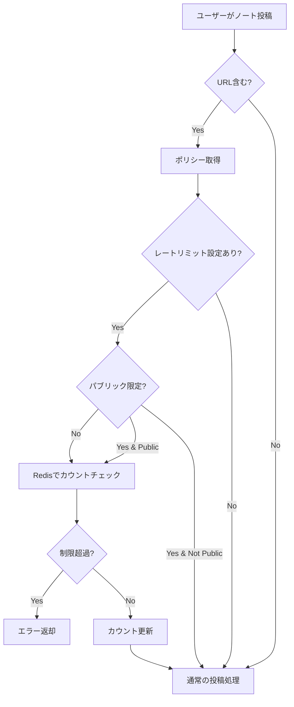

# URL付きノートのレートリミット機能 設計書

## 概要

外部リンク（URL）を含むノートの投稿に対して、時間あたりの投稿回数を制限する機能をロールポリシーとして実装します。

## 実装状況

**実装完了日**: 2025-12-19
**実装状態**: ✅ コア機能実装完了（テスト未実施）

### 実装済みファイル

1. **[`packages/backend/src/misc/extract-urls-from-mfm.ts`](packages/backend/src/misc/extract-urls-from-mfm.ts)** - 新規作成
   - MFMトークンからURLを抽出するユーティリティ関数
   - `extractUrlsFromMfm()`: URLの配列を返す
   - `hasUrl()`: URL含有チェック

2. **[`packages/backend/src/core/RoleService.ts`](packages/backend/src/core/RoleService.ts)** - 修正
   - `RolePolicies`型に3つの新プロパティを追加
   - `DEFAULT_POLICIES`にデフォルト値を設定
   - `getUserPolicies()`にポリシー計算ロジックを追加

3. **[`packages/backend/src/models/json-schema/role.ts`](packages/backend/src/models/json-schema/role.ts)** - 修正
   - `packedRolePoliciesSchema`に新ポリシーのスキーマ定義を追加

4. **[`packages/backend/src/core/NoteCreateService.ts`](packages/backend/src/core/NoteCreateService.ts)** - 修正
   - `create()`メソッドにURL検出とレートリミットチェックを実装
   - エラーID: `2e86dcc0-592c-49f6-99bf-4fcd262ad972`

5. **[`packages/backend/src/server/api/endpoints/notes/create.ts`](packages/backend/src/server/api/endpoints/notes/create.ts)** - 修正
   - エラー定義`noteWithUrlRateLimitExceeded`を追加
   - HTTPステータスコード429を返却

6. **[`locales/ja-JP.yml`](locales/ja-JP.yml)** - 修正
   - 日本語エラーメッセージを追加

7. **[`locales/en-US.yml`](locales/en-US.yml)** - 修正
   - 英語エラーメッセージを追加

### 互換性確認

- ✅ [`RateLimiterService.limit()`](packages/backend/src/server/api/RateLimiterService.ts:54)の既存呼び出しとの互換性確認済み
- ✅ 既存のレートリミット機能に影響なし
- ✅ データベースマイグレーション不要

## 要件

1. ロールポリシーに「URL付きノートのレートリミット」を追加
   - 時間単位での投稿回数制限（例: 1時間に10回まで）
   - パブリック投稿のみに制限するオプション
2. 既存のレートリミット機構（Redis）を活用してカウント
3. 制限超過時は適切なエラーを返す
4. フロントエンドでエラー表示

## アーキテクチャ



## 詳細設計

### 1. データ構造

#### 1.1 RolePolicies型の拡張

**ファイル**: [`packages/backend/src/core/RoleService.ts`](packages/backend/src/core/RoleService.ts:35)

```typescript
export type RolePolicies = {
  // ... 既存のポリシー ...
  
  // 新規追加
  noteWithUrlLimit: number;              // URL付きノート制限数（0 = 無制限）
  noteWithUrlLimitDuration: number;      // 制限期間（ミリ秒）
  noteWithUrlLimitPublicOnly: boolean;   // パブリック投稿のみ制限するか
};
```

**デフォルト値** (`DEFAULT_POLICIES`):
```typescript
noteWithUrlLimit: 0,                      // デフォルトは無制限
noteWithUrlLimitDuration: 60 * 60 * 1000, // 1時間
noteWithUrlLimitPublicOnly: false,        // すべての公開範囲に適用
```

#### 1.2 JSONスキーマの追加

**ファイル**: [`packages/backend/src/models/json-schema/role.ts`](packages/backend/src/models/json-schema/role.ts:167)

`packedRolePoliciesSchema` に追加:
```typescript
noteWithUrlLimit: {
  type: 'integer',
  optional: false, nullable: false,
},
noteWithUrlLimitDuration: {
  type: 'integer',
  optional: false, nullable: false,
},
noteWithUrlLimitPublicOnly: {
  type: 'boolean',
  optional: false, nullable: false,
},
```

### 2. URL検出ロジック

#### 2.1 新規ユーティリティ関数の作成

**新規ファイル**: `packages/backend/src/misc/extract-urls-from-mfm.ts`

```typescript
import * as mfm from 'mfm-js';

/**
 * MFMトークンからURLを抽出
 * @param nodes MFMノードの配列
 * @returns URL文字列の配列
 */
export function extractUrlsFromMfm(nodes: mfm.MfmNode[]): string[] {
  const urls: string[] = [];
  
  function extractFromNode(node: mfm.MfmNode): void {
    if (node.type === 'url') {
      urls.push(node.props.url);
    } else if (node.type === 'link') {
      urls.push(node.props.url);
    } else if ('children' in node && node.children) {
      for (const child of node.children) {
        extractFromNode(child);
      }
    }
  }
  
  for (const node of nodes) {
    extractFromNode(node);
  }
  
  return urls;
}

/**
 * ノートにURLが含まれるかチェック
 * @param tokens MFMトークン
 * @returns URLが含まれる場合true
 */
export function hasUrl(tokens: mfm.MfmNode[]): boolean {
  return extractUrlsFromMfm(tokens).length > 0;
}
```

### 3. レートリミットチェック

#### 3.1 NoteCreateServiceの修正

**ファイル**: [`packages/backend/src/core/NoteCreateService.ts`](packages/backend/src/core/NoteCreateService.ts:393)

[`create()`](packages/backend/src/core/NoteCreateService.ts:393) メソッド内、MFMパース後（行519付近）に追加:

```typescript
// MFMトークンからURL検出
const hasUrls = tokens.length > 0 && hasUrl(tokens);

if (hasUrls) {
  const policies = await this.roleService.getUserPolicies(user.id);
  
  // URL付きノートのレートリミットチェック
  if (policies.noteWithUrlLimit > 0) {
    // パブリック限定オプションのチェック
    const shouldLimit = !policies.noteWithUrlLimitPublicOnly || 
                       data.visibility === 'public';
    
    if (shouldLimit) {
      const rateLimitKey = `noteWithUrl:${user.id}`;
      const rateLimit = await this.rateLimiterService.limit(
        {
          key: rateLimitKey,
          duration: policies.noteWithUrlLimitDuration,
          max: policies.noteWithUrlLimit,
        },
        user.id,
        1 // factorは1固定（ポリシーで制限値を調整）
      );
      
      if (rateLimit != null) {
        throw new IdentifiableError(
          '2e86dcc0-592c-49f6-99bf-4fcd262ad972',
          'Note with URL rate limit exceeded',
          rateLimit.info
        );
      }
    }
  }
}
```

#### 3.2 RateLimiterServiceの型修正

**ファイル**: [`packages/backend/src/server/api/RateLimiterService.ts`](packages/backend/src/server/api/RateLimiterService.ts:54)

[`limit()`](packages/backend/src/server/api/RateLimiterService.ts:54) メソッドのシグネチャを汎用化:

```typescript
public async limit(
  limitation: { 
    key: string; 
    duration?: number; 
    max?: number; 
    minInterval?: number;
  }, 
  actor: string, 
  factor = 1
): Promise<RateLimitInfo | null>
```

### 4. エラーハンドリング

#### 4.1 エンドポイントでのエラー定義

**ファイル**: [`packages/backend/src/server/api/endpoints/notes/create.ts`](packages/backend/src/server/api/endpoints/notes/create.ts:42)

`meta.errors` に追加:

```typescript
noteWithUrlRateLimitExceeded: {
  message: 'Note with URL rate limit exceeded.',
  code: 'NOTE_WITH_URL_RATE_LIMIT_EXCEEDED',
  id: '2e86dcc0-592c-49f6-99bf-4fcd262ad972',
  httpStatusCode: 429,
},
```

#### 4.2 エラーキャッチの追加

[`catch`](packages/backend/src/server/api/endpoints/notes/create.ts:249) ブロックに追加:

```typescript
} else if (err.id === '2e86dcc0-592c-49f6-99bf-4fcd262ad972') {
  throw new ApiError(meta.errors.noteWithUrlRateLimitExceeded, err.info);
```

### 5. フロントエンド対応

#### 5.1 エラーメッセージの追加

**ファイル**: `locales/ja-JP.yml`

```yaml
_errors:
  noteWithUrlRateLimitExceeded: "URLを含むノートの投稿回数制限に達しました。しばらく待ってから再度お試しください。"
```

**ファイル**: `locales/en-US.yml`

```yaml
_errors:
  noteWithUrlRateLimitExceeded: "You have reached the rate limit for posting notes with URLs. Please wait and try again later."
```

#### 5.2 エラー表示処理

**ファイル**: [`packages/frontend/src/components/MkPostForm.vue`](packages/frontend/src/components/MkPostForm.vue)

エラーハンドリング部分で429エラーのメッセージを表示:

```typescript
.catch(err => {
  if (err.code === 'NOTE_WITH_URL_RATE_LIMIT_EXCEEDED') {
    const reset = err.info?.reset;
    const waitTime = reset ? Math.ceil((reset - Date.now()) / 1000 / 60) : null;
    const message = waitTime 
      ? i18n.ts._errors.noteWithUrlRateLimitExceeded + ` (${waitTime}分後に再試行可能)`
      : i18n.ts._errors.noteWithUrlRateLimitExceeded;
    os.alert({ type: 'error', text: message });
  }
  // ... 既存のエラーハンドリング ...
});
```

### 6. Redisキー設計

#### レートリミット用Redisキー

```
noteWithUrl:{userId}
```

- **有効期限**: ポリシーの `noteWithUrlLimitDuration` に基づく
- **値**: カウンター（残り投稿可能回数）
- **実装**: `ratelimiter` ライブラリ（既存のレートリミットと同様）

### 7. ポリシー計算

**ファイル**: [`packages/backend/src/core/RoleService.ts`](packages/backend/src/core/RoleService.ts:398)

[`getUserPolicies()`](packages/backend/src/core/RoleService.ts:371) メソッドの return 部分に追加:

```typescript
noteWithUrlLimit: calc('noteWithUrlLimit', vs => Math.max(...vs)),
noteWithUrlLimitDuration: calc('noteWithUrlLimitDuration', vs => Math.max(...vs)),
noteWithUrlLimitPublicOnly: calc('noteWithUrlLimitPublicOnly', vs => vs.some(v => v === true)),
```

## 実装順序

1. **バックエンド基盤**
   - [x] `extract-urls-from-mfm.ts` ユーティリティ作成
   - [x] `RolePolicies` 型定義更新
   - [x] JSONスキーマ更新
   - [x] `DEFAULT_POLICIES` 更新
   - [x] `getUserPolicies()` のポリシー計算追加

2. **レートリミット機能**
   - [x] `RateLimiterService.limit()` の互換性確認（変更不要）
   - [x] `NoteCreateService.create()` にURL検出とレートリミットチェック追加
   - [x] エラー定義の追加

3. **エンドポイント**
   - [x] `notes/create` エンドポイントのエラーハンドリング追加

4. **フロントエンド**
   - [x] ローカライゼーションファイルにエラーメッセージ追加
   - [ ] `MkPostForm.vue` のエラー表示処理追加（オプション）

5. **テストとドキュメント**
   - [ ] ユニットテスト作成
   - [ ] 統合テスト作成
   - [ ] APIドキュメント更新

## テストケース

### 単体テスト

1. **extract-urls-from-mfm.ts**
   - URLノードの検出
   - linkノードの検出
   - ネストされたURLの検出
   - URLが含まれない場合

2. **RoleService**
   - ポリシー計算の正確性
   - 複数ロールのポリシー集約

3. **NoteCreateService**
   - URL含むノートのレートリミット適用
   - URL含まないノートは制限なし
   - パブリック限定オプションの動作
   - 制限超過時のエラー

### 統合テスト

1. URL付きノートを連続投稿して制限に達する
2. 制限時間経過後に再度投稿可能になる
3. パブリック限定オプションが有効な場合、非パブリック投稿は制限されない
4. 異なるロールのポリシーが正しく適用される

## セキュリティ考慮事項

1. **DoS対策**: レートリミット自体がDoS対策となる
2. **キャッシュ汚染**: ユーザーIDベースのキーで分離
3. **権限昇格**: ロールポリシーは管理者のみが設定可能
4. **情報漏洩**: エラーメッセージに機密情報を含めない

## パフォーマンス考慮事項

1. **MFMパース**: 既にパース済みのトークンを再利用するため、追加コストは最小限
2. **Redisアクセス**: 既存のレートリミット機構と同様、1回のRedis呼び出し
3. **ポリシー取得**: キャッシュ済みのポリシーを使用

## マイグレーション

データベーススキーマの変更は不要（ロールポリシーはJSONBで保存されているため）。
既存のロールには自動的にデフォルト値が適用されます。

## 管理画面での設定

ロール編集画面で以下の項目を追加:

- **URL付きノート制限数**: 数値入力（0 = 無制限）
- **制限期間**: プリセット選択（5分、15分、30分、1時間、6時間、12時間、24時間）
- **パブリック投稿のみ制限**: チェックボックス

## 互換性

- 既存のレートリミット機能と共存
- 既存のロールポリシーへの影響なし
- データベースマイグレーション不要

## 今後の拡張可能性

1. URL数による重み付け（URLが多いほど重くカウント）
2. 特定ドメインの除外リスト
3. 短縮URLの展開と検証
4. スパムドメインのブラックリスト連携
